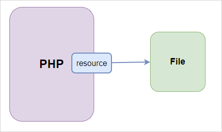

# PHP
+ PHP is a server-side and general-purpose scripting language especially suited for web development
+ PHP originally stood for Personal Home Page. However, now, it stands for Hypertext Preprocessor.
+ PHP was created by Rasmus Lerdorf in 1994

# PHP is a server-side language
When you open a website on your web browser, for example, https://www.phptutorial.net

The web browser sends an HTTP request to a web server where phptutorial.net is located. The web server receives the request and responds with an HTML document.

In this example, the web browser is a client, while the web server is the server. The client requests for a page, and the server serves the request.

PHP runs on the web server, processes the request, and returns the HTML document.
# PHP is a general-purpose language
+ Programming languages according to purpose can be: domain-specific and general-purpose languages.
+ Domain-specific languages are used within specific application domains. For example, SQL is a domain-specific language. It’s used mainly for querying data from relational databases and cannot be used for other purposes.
+ On the other hand, PHP is a general-purpose language because PHP can develop various applications.

# PHP is a cross-platform language
+ PHP can run on all major operating systems, including Linux, Windows, and macOS.
+ PHP can be used with all leading web servers, such as Nginx, OpenBSD, and Apache.
+  Some cloud environments, such as Microsoft Azure and Amazon AWS, also support PHP.
+ PHP is not just limited to processing HTML. It supports generating PDF, GIF, JPEG, and PNG images.
+ One notable feature of PHP is that it supports many databases, including MySQL, PostgreSQL, MS SQL, db2, Oracle Database, and MongoDB.

# What can PHP do
PHP has two main applications:
   + Server-side scripting – PHP is well-suited for developing dynamic websites and web applications.
   + Command-line scripting: Like Python and Perl, you can run PHP scripts from the command line to perform administrative tasks like sending emails and generating PDF files.

# How PHP works

How PHP works:
 + First, the web browser sends an HTTP request to the web server, e.g., index.php.
 + Second, the PHP preprocessor located on the web server processes PHP code to generate the HTML document.
 + Third, the web server returns the HTML document to the web browser.

# Advantages of PHP
+ Simple
+ Fast
+ Stable
+ Open-source and Free
+ Community Support

# Installing PHP
+ Installing PHP on your computer allows you to safely develop and test a web application without affecting the live (deployed) system.
+ To work with PHP locally, you need to have the following software:
   + PHP
   + A web server that supports PHP. We’ll use the [Apache webserver](https://httpd.apache.org/)
   + A database server. We’ll use the [MySQL database server](https://www.mysql.com/)
+ Basically, installing all this software separately is tricky and not intended for beginners. Rather, we use 
an all-in-one software package that includes PHP, a web server, and a database server. One of the most popular is [XAMPP](https://www.apachefriends.org/) 
which is an easy-to-install Apache distribution that contains PHP, MariaDB, and an Apache webserver. It supports Windows, Linux, and MacOS
+ Note that MariaDB is a fork of the most popular relational database management system, MySQL. That is MariaDB is very similar to MySQL.
  + A fork is when developers take the source code of an existing project and start developing it independently as a separate project.
# Download XAMPP
+ To install XAMPP on Windows, go to the [XAMPP official website](https://www.apachefriends.org/index.html) and download the appropriate version for your platform.
+ While installing, in the selection of components that you want to install, select Apache, MySQL, PHP, and phpMyAdmin, deselect other components, and click the Next button to go to the next step.
# Troubleshooting 
+ By default, Apache uses port 80. However, if port 80 is used by another service, you’ll get an error like this<pre>```Problem detected!
Port 80 in use by "Unable to open process" with PID 4!
Apache WILL NOT start without the configured ports free!
You need to uninstall/disable/reconfigure the blocking application
or reconfigure Apache and the Control Panel to listen on a different port```</pre>
+ In this case, you must change the port from 80 to a free one, e.g., 8080. To do that, you follow these steps:
    + First, click the Config button that aligns with the Apache module:
    
    + Second, find the line that has the text Listen 80 and change the port from 80 to 8080 like this:
    
    + Third, click the Start button to start the Apache service. If the port is free, Apache should start properly, as shown in the following picture:
    

# How to write a PHP Program on the web browser
+ First, open the folder `htdocs` under the xampp folder. Typically, it is located at `C:\xampp\htdocs`.
+ In that folder, create your project directory
+ Create your PHP file(s) with the `.php` extension
+ Basically, your code will be in the form
```
<!DOCTYPE html>
<html lang="en">
  <head>
    <title>PHP Project</title>
  </head>
  <body>
    <h1><?php echo 'Hello World'; ?></h1>
  </body>
</html>
```
+ Notice that the code in our PHP file looks like a regular HTML document except for the part `<?php` and `?>`.
+ The code between the opening tag `<?php` and closing tag `?>` is PHP:
+ This PHP code prints out the Hello, World message inside the `h1` tag using the `echo` statement (similar to `print()` in Python or `console.log()` in JS:
+ Now, to see the output of your PHP code (here, output is Hello World) on the web through the browser, type `localhost/ProjectDirName`
+ If you view the source code of the page, you’ll see the following HTML code:
```<!DOCTYPE html>
<html lang="en">
<head>
    <meta charset="UTF-8">
    <meta name="viewport" content="width=device-width, initial-scale=1.0">
    <title>PHP - Hello, World!</title>
</head>
<body>
        <h1>Hello, World!</h1>
</body>
</html>
```
# PHP Hello World on the command line 
+ First, open Xampp Control Panel
+ Second, navigate to the Xampp Shell through that, navigate to `c:\xampp\htdocs\ProjectDirName\`.
+ Third, type the following command to execute the index.php file:
```
c:\xampp\htdocs\ProjectDirName>php index.php
```
+ You’ll see the HTML output. Since the terminal doesn’t know how to render HTML to the web, it just shows the pure HTML code.
+ To fix this, write only the PHP code in the PHP file and delete all HTML
+ Now, when you embed PHP code with HTML, you need to have the opening tag <?php and closing tag ?>. However, if the file contains only PHP code, you don’t need to the closing tag ?> like the index.php above.
# PHP Syntax
+ If you decide to mix your PHP code with your HTML file, you need to have the opening tag (`<?php`) and the enclosing tag (`?>`) 
+ For example
```
<!DOCTYPE html>
<html lang="en">
<head>
    <meta charset="UTF-8">
    <title>PHP Syntax</title>
</head>
<body>
        <h1><?php echo 'PHP Syntax'; ?></h1>
</body>
</html>
```
+ However, if a file is expected to contain only a PHP code, the enclosing tag is optional
```php
<?php
  echo Hello World
```
# Case Sensitivity
+ PHP is partially case-sensitive. For example, if you have a function such as count, you can use it as COUNT. It would work properly
+ The following are case-insensitive in PHP:
  + PHP constructs such as if, if-else, if-elseif, switch, while, do-while, etc
  + Keywords such as true and false
  + User-defined function & class names
+ On the other hand, variables are case-sensitive. e.g., `$message` and `$MESSAGE` are different variables.
# Statements
+ A statement is a piece of code that is executed but doesn't yield a value. Statements includes such as assigning a value to a variable or calling a function.
+ A statement usually end with a semi-colon `;` 
+ Below is a statement that assigns a literal string to the `$message` variable:
+ 
```php
$message = "Hello";
```
This is a Simple statement
+ A Compound statement consists of one or more simple statements. It uses Curly Braces to mark a block of code. Example
```php
if( $is_new_user ) {
    send_welcome_email();
}
```
You don’t need to place the semicolon after the curly brace (`}`)
+ Also, the closing tag of a PHP block (`?>`) automatically implies a semicolon (`;`). Therefore, you don’t need to place a semicolon in the last statement in a PHP block.
# Whitespace & line breaks
+ Whitespace and line breaks don’t have special meaning in PHP. For Example,
```php
login( $username, $password );
```
and
```php
login( 
  $username, 
  $password 
);
```
are equivalent
# PHP Variables
## Defining a variable
+ A variable stores a value of any type, e.g., a string, a number, an array, or an object.
+ To define a variable, you use the following syntax:
```php
$variable_name = value;
```
+ When defining a variable, you need to follow these rules:
  + The variable name must start with the dollar sign (`$`).
  + The first character after the dollar sign (`$`) must be a letter (a-z) or the underscore (`_`)
  + The remaining characters can be underscores, letters, or numbers.
+ To display the values of variables on a webpage, you’ll use the `echo` construct. For example:
```html
<!DOCTYPE html>
<html lang="en">
<head>
    <meta charset="UTF-8">
    <meta name="viewport" content="width=device-width, initial-scale=1.0">
    <title>PHP Variables</title>
</head>
<body>
    <?php
        $title = 'PHP is awesome!';
    ?>
    <h1><?php echo $title; ?></h1>
</body>
</html>
```
+ Mixing PHP code with HTML will make the code unmaintainable, especially when the application grows. To avoid this, you can separate the code into separate files. For example
  + `index.php` – store the logic for defining and assigning value to variables.
  + index.view.php – store the code that displays the variables
  + Use the `require` construct to include the code from the `index.view.php` in the `index.php` file.
  + The `require` construct is used to include and evaluate a PHP file. Essentially, it takes the content of the specified file and inserts it at the point where require is called.
For example suppose you created a different PHP file for storing your variables, say `index.php` and another PHP file that contains the HTML with PHP Embeded code, say `index.view.php`. We can include the `index.php` file
by simply writing ```require 'index.view.php'``` in the `index.php` file
The code `<?= $name ?>` is a shorthand for `<?php echo $name ?>`

# PHP Comments
+ Comments are essentially useful information for anyone reading the code. Comments are ignored by the PHP engine.
+ PHP supports three types of comments:
  + Single-line comments using `//` or `#`
  + Multi-line comments using `/* */`
+ Comments are written at the end of a line or a code block or on a separate line. For example
```php
// This is a single-line comment
# This is also a single-line comment
/* This is a 
   multi-line comment */
```
+ Comments are useful for:
  + Explaining the purpose of the code
  + Making notes for future reference
  + Temporarily disabling code during debugging
+ Comments should be clear and concise to effectively communicate the intended message to anyone reading the code.
+ Comments should explain why a code works not what the code does. For example, the following comment is not useful
```php
  $total = $price * $quantity; // Multiply price by quantity to get total
```
+ A better comment would be
```php
  // Calculate the total cost of items in the shopping cart
  $total = $price * $quantity;
```
# PHP Constants
+ PHP constants are basically a name that holds a value. PHP constants are similar to PHP variables with the exception that
  + Constants by convention don't use the dollar sign (`$`) prefix compare to variables. Also, Constants are defined in uppercase letters. Notice that `SITE_NAME` and `site_name` are different
  + Once the value of a constant is defined, it cannot be changed or undefined
+ PHP constants are defined using
  + The `define()` function - This function takes two parameters: first, the name of the constant and and secondits value. Example
```php
  define( 'SITE_NAME', 'My PHP Website' );
  The `define` function cannot be used to define constants within a class.
  + The `const` keyword - This keyword is used to define constants within a class or outside a class. Example 
  ```php
  class Config {
      const VERSION = '1.0.0';
  }
  ```
  is a better syntax to define constants within a class. Also
  ```php
  class Config {
    define( 'Config::VERSION', '1.0.0' );
  }
  ``` 
  is an invalid.
+ `define()` vs `const`
  + The `define()` function can be used to define constants at runtime, while the `const` keyword is used to define constants at compile time.
  + The `const` keyword can be used to define constants within a class, while the `define()` function cannot.
  + The `const` keyword supports visibility modifiers (public, protected, private) when defining constants within a class, while the `define()` function does not.
  + The define() is a function while the const is a language construct. That is `const` defines a function at run-time (execution time) while `const` defines a constant at compile-time (Compile time is when your code is checked, translated, and prepared before execution). Thus `const` is faster than `define()`.
  + The `define` function allows to name a constant using an expression, while the `const` keyword requires a constant name to be a valid identifier. Example
  ```php
    define( 'SITE_' . 'NAME', 'My PHP Website' ); // Valid
    const SITE_' . 'NAME' = 'My PHP Website'; // Invalid
  ```
# PHP `var_dump()` function
+ The `var_dump()` function is a built-in PHP function that dumps the value of a variable. It accepts a variable and display its type, value and size. For example, if the data-type of a variable is an string, it will display the type as "string", the value as the string itself, and the size as the number of bytes used to store the string (number of characters). Syntax
```php
var_dump( $variable );
```
+ To dump information about multiple variables, you can pass them as a comma-separated list to the `var_dump()` function. Example
```php
$age = 25;
$name = "John Doe";
var_dump( $age, $name );
```
+ To have a more intutive output, you can wrap the `var_dump()` function inside HTML `<pre>` tags. Example
```php
$age = 25;
$name = "John Doe";
echo '<pre>';
var_dump( $age);
echo '</pre>';
echo '<pre>';
var_dump($name);
echo '</pre>';
```
+ # The dump helper function
+ It's always tedious to write the `<pre>` tags whenever you want to use the `var_dump()` function. To avoid this, you can create a helper function that takes in variables as parameters and wraps the `var_dump()` function inside the `<pre>` tags. Example
```php
function dump( $variable ) {
    echo '<pre>';
    var_dump( $variable );
    echo '</pre>';
}```
+ Now, you can use the `dump()` function instead of the `var_dump()` function. Example
```php
dump($age)
dump($name)
```
# Dump and Die using the `var_dump()` function and `die()` function
+ Sometimes, while debugging your code, you want to dump the value of a variable and stop the execution of the script immediately. To do that, you can use the `var_dump()` function along with the `die()` function. The `die()` function is used to terminate the current script. Example
```php
$age = 25;
var_dump( $age );
die();
```
Notice that any code after the `die()` function will not be executed
+ The `die()` function is similar to be `break` statement in other programming languages. It stops the execution of the script immediately.
+ To make it more intutive, you can create a helper function that combines the `var_dump()` function and the `die()` function. Example
```php
function dump_die($variable) {
  echo '<pre>';
  var_dump( $variable );
  echo '</pre>';
  die();
}
```
+ Now, you can use the `dump_die()` function to dump the value of a variable and stop the execution of the script
# PHP Data Types
+ A type specifies the amount of memory allocated to store a value and the operations that can be performed on that value.
+ PHP has 10 primitive data types - four scalars, four compound types, and two special types. They include:
  + String
  + Integer
  + Float (also called double)
  + Boolean
  + Array
  + Object
  + Callable
  + Iterable
  + NULL
  + Resource


# Scalar Types
+ A variable is scalar when it holds a single value of the type integer, boolean, flot(double), or string.
  + Integers are whole numbers defined from the set of positive and negative numbers including zero (Z). They are without decimal points. The size of an integer depends on the system in which PHP is running. For example, On a 32-bit system, the size of an integer is 4 bytes, while on a 64-bit system, it is 8 bytes. The constant `PHP_INT_SIZE` specifies the size of the integer on a specific platform
  + Floats (or doubles) are numbers that have decimal points or are in exponential form. They are real numbers. PHP uses the [IEEE 754 double-precision](https://en.wikipedia.org/wiki/Double-precision_floating-point_format) format to store float values. The size of a float is platform-dependent, but it is typically 8 bytes (64 bits) on most systems. Floating-point numbers includes:
    + Decimal notation: e.g., 3.14, -0.001, 42.0
    + Exponential notation: e.g., 1.5e3 (which is equivalent to 1.5 * 10^3 or 1500)
  + Boolean represents a truth value that can be either true or false. In PHP, the boolean values are represented by the keywords `true` and `false`. Boolean values are often used in conditional statements and logical operations. Since booleans are case-insensitive, you can also write them as `TRUE` and `FALSE`.
  When you use other data types in a boolean context, PHP automatically converts them to boolean values using the following rules:
    + The following values are considered false:
      + The boolean value `false`
      + The integer value `0` (zero)
      + The float value `0.0` (zero)
      + An empty string `""` or a string containing only whitespace characters
      + An array with no elements
      + The special type `NULL`
      + The `SimpleXML` objects created from attributeless empty elements
    + All other values are considered true.
  + Strings are sequences of characters surrounded by either single (' ') or double (" ") quotes. Strings can contain letters, numbers, symbols, and whitespace characters.
# Compound Types
+ Compound types include values that can hold multiple values or collections of values. The compound types in PHP are arrays and objects. They include:
  + Arrays - An array is an ordered map that associates keys to values. There are three types of arrays in PHP:
    + Indexed arrays - These are arrays where the keys are numeric indices starting from 0. Example
    ```php
    $fruits = array("Apple", "Banana", "Orange"); // $fruits = ["Apple", "Banana", "Orange"];
    ```
    + Associative arrays - These are arrays where the keys are strings. Example
    ```php
    $person = array("name" => "John", "age" => 30, "city" => "New York"); // $person = ["name" => "John", "age" => 30, "city" => "New York"];
    ```
    + Multidimensional arrays - These are arrays that contain other arrays as elements. Example
    ```php
    $matrix = array(
        array(1, 2, 3),
        array(4, 5, 6),
        array(7, 8, 9)
    ); // $matrix = [[1, 2, 3], [4, 5, 6], [7, 8, 9]];
    ```
  + Objects - An object is an instance of a class. An object consist of properties (attributes) and methods (functions). Example
  ```php
# Special Types
+ They include
  + NULL - NULL simply represents a variable with no value. It is represented by the `null` keyword
  + Resource - is a specisl variable that references to another source outside of PHP. For example, a database connection is a resource. Resources are created and used by special functions in PHP. When you are done using a resource, you should free it using the appropriate function to avoid memory leaks. Other examples of resources include file handles, image canvases, and network connections.
  